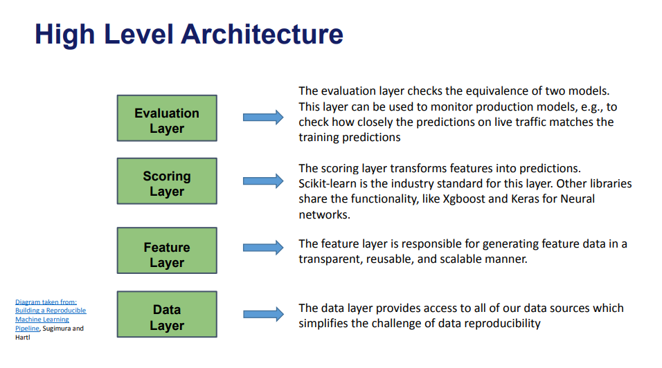
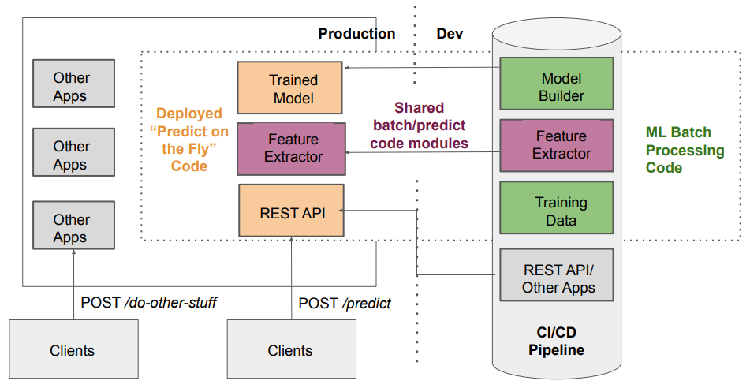

# ML Production Scaffold

This repository provides a scaffold for deploying Machine Learning models into production, including project structure, APIs, and deployment pipelines.

## Architecture Component Breakdown

The proposal is a "High-Level Architecture" diagram for a machine learning system, consisting of four layers:

Evaluation Layer - This layer ensures the equivalence of two models and monitors production models by comparing live traffic predictions with training predictions.
Scoring Layer - Converts features into predictions. Standard libraries for this layer include Scikit-learn, XGBoost, and Keras.
Feature Layer - Responsible for generating reusable, transparent, and scalable feature data.
Data Layer - Provides access to all data sources, simplifying data reproducibility challenges.

Each layer is visually represented with green boxes and arrows pointing to descriptions. The diagram is sourced from Building a Reproducible Machine Learning Pipeline by Sugimura and Hartl.



## Workflow Summary

Clients send requests to the REST API for predictions. The API utilizes the Feature Extractor and the Trained Model to generate predictions. The CI/CD Pipeline automates updates, ensuring new models and feature extraction logic remain consistent between training and production. This architecture balances real-time inference with a robust development workflow for continuous model improvement.



## Repository Structure

```
ml_production_scaffold/
│-- regression_model/
│   │-- config/   # General configurations
│   │-- datasets/ # Model input data
│   │-- processing/  # Model definition
│   │-- trained_models/  # Trained Models
│   │-- config.yml  # General configurations
│   │-- pipeline.py  # Preprocessing pipeline
│   │-- predict.py  # Inference code
│   │-- train_pipeline.py  # Training script
│   │-- VERSION
│-- api/
│   │-- app/
│   │   │-- tests/
│   │   │-- schems/
│   │   │-- main.py
│   │   │-- config.py
│   │   │-- api.py
│-- requirements/
│   │-- requirements.txt  # Requirements file
│   │-- test_requirements.txt  # Requirements to test environment
│-- tests/ # Unit tests
│-- setup.py  # setup project
│-- MANIFEST.in
│-- pyproject.toml  # Project dependencies
│-- tox.ini  # Project dependencies
│-- README.md  # Project documentation
```

## Requirements

Ensure you have Python 3.8+ installed and run:
```sh
pip install -r requirements.txt
```

## Model Training

To train the model:
```sh
python src/train.py
```

## Running the API

To start the API using FastAPI:
```sh
uvicorn api.main:app --host 0.0.0.0 --port 8000
```

## Testing

To run the tests:
```sh
pytest tests/
```

## Deployment with Docker

To build and run the container:
```sh
docker build -t ml_model .
docker run -p 8000:8000 ml_model
```
